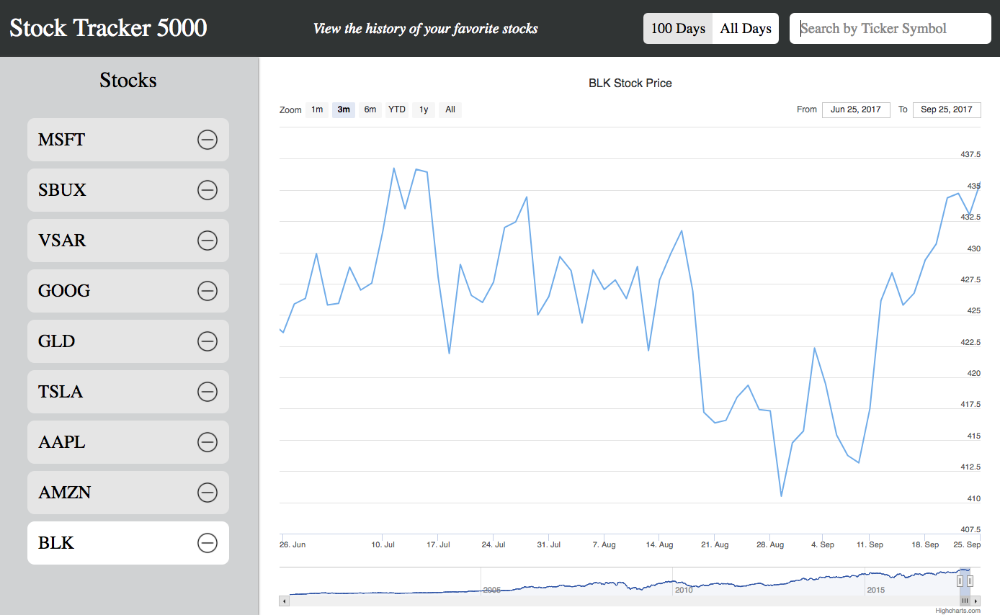

# Stock Tracker 5000

URL: [Live-link](http://justinwhite.me/stock-ticker-interface/#/)



Stock Tracker 5000 is a web application built using React.js which allows a person to easily track their favorite stocks overtime. 

## Run locally

To run the application on your local machine, first clone the repo

```
git clone https://github.com/Jstuff36/stock-ticker-interface.git
```

then copy and paste the local path to [index.html](./index.html) file into your browser. 

To edit the code and have your local copy in your browser reflect the changes, run 

```
webpack -w
```

in the terminal. 

## Features

* Search stock by ticker symbol
* Visualize stock price over time 
* Follow and remove stocks
* Persist stocks currently following across browser refresh and closes 

## Search stock by ticker symbol


Users have the ability to follow various stock by typing its corresonding ticker symbol in the search bar. This then hits the [Alpha Vantage API](https://www.alphavantage.co/) which returns a blob of data which is parased and plotted. The API has two settings for the amount of data you can retrieve, the previous 100 days or everyday. A user can toggle between these two by clicking the `100 Days` and the `All Days` buttons in the navigation bar. 

## Visualize stock prices over time


Using the [React Highcharts library](https://github.com/kirjs/react-highcharts), a stock's price over time is graphed. A side bar highlights the stock currently graphed, while React Highcharts allows a user to visualize the stock over one month, two months, six months, year to date, and on year time periods. Additionally, a user can hover over the graph to see the indiviudal data points. 

## Follow and remove stocks


When a user types a stock into the search bar, the results appear on a side bar containing all stocks the user is following. This side bar allows a user to remove a stock therefore unfollowing it and select a stock to graph. 

## Persist stocks across browser refresh and close


Using the [redux-persist](https://github.com/rt2zz/redux-persist) library the redux store persist across browser refresh with the following code. 

```
let store = compose(
    applyMiddleware(...middlewares),
    autoRehydrate()
)(createStore)(rootReducer);

persistStore(store);
```
This means that the stocks a user has searched for will persist if they refresh or close their browser thus eliminating the need to refresh to repeat queries everytime a user returns to the site.